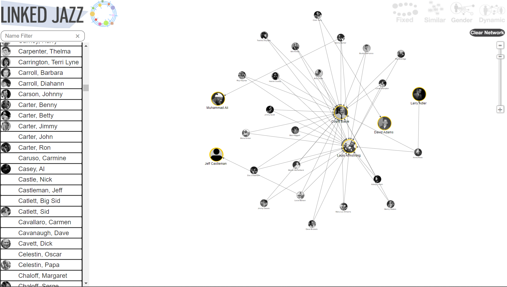

## Linked Jazz

### Source

[https://linkedjazz.org/](https://linkedjazz.org/)

### Evaluation

LinkedJazz is a website that aims to provide a comprehensive and interconnected resource for researchers, educators, and enthusiasts of jazz music. Linked Jazz is directed by Prof. Cristina Pattuelli from the Pratt Institute School of Library Information Science. The project is backed and supported by a multitude of institutions, including the Semantic Lab at Pratt, Rutgers Institute for Jazz Studies Archives, Smithsonian Jazz Oral Histories, the Hamilton College Jazz archive, and many other universities such as UCLA and UMich to name a few.

One of the standout features of LinkedJazz is its extensive database of jazz musicians, recordings, and events. The database is searchable by various criteria, such as musician name, instrument, and record label, with detailed information about each artist and recording. The database also includes links to external sources, such as Wikipedia and AllMusic, which provides additional information and context. A key benefit of this resource is the ability to quickly discern connections and trends between different jazz artists and musicians. This removes the need to research the correlations between musicians individually and allows for an immediate distant read.  

Another useful feature of the website is its collection of jazz ontologies. These ontologies provide a consistent and standardized way of representing information about jazz, which makes it easier to search and analyze the data. The visual animations and links between each musician creates a fun and engaging website experience. All the information about each artist is largely intuitive, with a helpful menu at the top that offers some pre-set visualizations of the data. The strongest tool, in my opinion, is the “Dynamic” option, that lets the user construct their own map by selecting which musicians to showcase. Links are then automatically displayed between the selected artists.

This website helps to more easily answer questions regarding musicians’ relations to one another, particularly in their work. A visualization tool such as this allows for an easy distant reading of jazz music history. It can also prompt new questions that may not be immediately evident without this tool--questions regarding culture, identity, gender, and diaspora. 

The only improvement I see with this website is if it’s possible to optimize the network visualization. When I opened the visualization on my laptop, the website ran a bit slowly with all the animations. The resource may be more accessible if there were a way to turn off the unnecessary, although enjoyable, animations. 

Overall, LinkedJazz is a valuable resource for anyone interested in learning about notable jazz musicians and other related individuals and their complex history. Its extensive database and structured ontologies make it an indispensable tool for researchers, and its user-friendly design makes it accessible to a wider audience.

